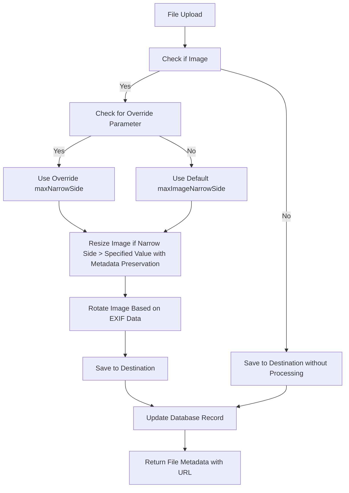

# Image Resizing Configuration Plan

## Overview
This document outlines the plan to add a new configuration key for setting a maximum dimension for the narrow side of uploaded images in the Koa2 file server project. The goal is to reduce the final file size of uploaded images by resizing them, with an optional override parameter provided during upload, while preserving EXIF data for correct rotation.

## Goals
1. **Add a New Configuration Key**: Introduce a new setting in [`src/config/appConfig.js`](../src/config/appConfig.js) to define the default maximum size for the narrow side of images.
2. **Allow User Override**: Enable an optional parameter during upload to override the default maximum narrow side dimension.
3. **Update Image Processing Logic**: Modify [`src/services/fileService.js`](../src/services/fileService.js) to use either the override value or the default configuration for resizing images, ensuring EXIF data is preserved.
4. **Ensure Compatibility**: Make sure the changes integrate with existing functionality without breaking current upload or processing workflows.

## Detailed Steps

1. **Update Configuration File ([`src/config/appConfig.js`](../src/config/appConfig.js))**
   - Add a new property `maxImageNarrowSide` to set the default maximum size for the narrow side of images.
   - Use environment variable `MAX_IMAGE_NARROW_SIDE` with a default value of 1600 pixels if not specified.
   - Include validation to ensure the value is a positive number.

2. **Modify Upload Middleware ([`src/upload/fileUploader.js`](../src/upload/fileUploader.js))**
   - Update the middleware to check for an optional query parameter or form field (e.g., `maxNarrowSide`) during file upload.
   - Pass this value to the `FileService` for processing if provided.

3. **Modify File Service for Resizing ([`src/services/fileService.js`](../src/services/fileService.js))**
   - Update the constructor to include the new `maxImageNarrowSide` configuration.
   - Enhance the `processImageFile` or related method to accept an optional override parameter for the maximum narrow side.
   - Resize images using the `sharp` library, ensuring the narrow side does not exceed the override value if provided, or the configured default otherwise, while maintaining aspect ratio.
   - Use `sharp` options to preserve EXIF metadata during resizing (e.g., `withMetadata()` method) to ensure rotation based on EXIF orientation data can still be applied correctly.
   - Ensure the resizing happens before rotation and saving to the final destination, with metadata preservation at each step.

4. **Testing and Validation**
   - Verify that the new configuration is correctly read from environment variables or defaults.
   - Test image uploads with and without the override parameter to confirm that resizing works as expected for various image dimensions and formats.
   - Confirm that EXIF data is retained post-resizing by checking if rotation is applied correctly based on orientation metadata.
   - Check that non-image files are unaffected by these changes.

## Process Flow Diagram

This diagram illustrates the updated file processing flow, including the preservation of EXIF metadata during resizing to ensure correct rotation.